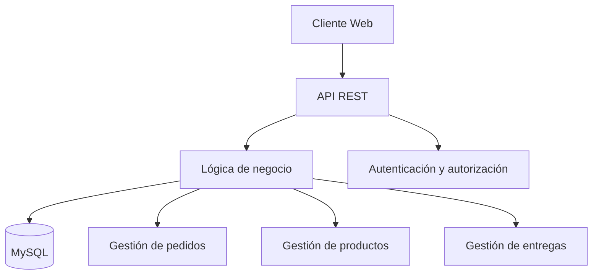

# Delivery Local

Plataforma de delivery local orientada al entorno universitario de **CUTlaquepaque**, diseñada para facilitar la compra, gestión y entrega de alimentos sin que el usuario tenga que desplazarse fuera de sus actividades.

> **Estado del repositorio:** documentación y base arquitectónica inicial. La implementación funcional se incorporará conforme avance el desarrollo.

##  Problema

Dentro del entorno universitario, estudiantes, docentes y personal pueden perder tiempo al desplazarse para conseguir alimentos. La propuesta de Delivery Local centraliza la oferta de comida y el proceso de pedido en una sola plataforma.

##  Solución

El sistema contempla un flujo de:

```text
Usuario
   ↓
Catálogo de alimentos
   ↓
Carrito
   ↓
Pedido
   ↓
Preparación
   ↓
Entrega dentro del área definida
```

El alcance inicial está pensado para **CUTlaquepaque y sus alrededores**, manteniendo el proyecto acotado a un contexto universitario.

##  Funcionalidades previstas

### Cliente
- Registro e inicio de sesión.
- Consulta de productos y categorías.
- Carrito de compras.
- Creación de pedidos.
- Consulta del estado del pedido.
- Historial de pedidos.

### Vendedor
- Administración de productos.
- Consulta y gestión de pedidos.
- Administración del catálogo.

### Administrador
- Gestión de usuarios y roles.
- Gestión de productos y vendedores.
- Supervisión de pedidos.
- Administración general del sistema.

### Entrega
- Definición del punto de entrega.
- Actualización del estado del pedido.
- Confirmación de entrega.

##  Visuales

La actividad solicita evidencias visuales del proyecto. Como el repositorio se encuentra en una etapa inicial y todavía no contiene una interfaz funcional publicada, **no se incluyen capturas ficticias**.

Cuando exista el prototipo, las capturas se agregarán en `docs/images/` y se documentará aquí el flujo principal:

1. Inicio / catálogo.
2. Detalle del producto.
3. Carrito.
4. Confirmación del pedido.
5. Seguimiento.
6. Panel de vendedor.

### Arquitectura propuesta



## Tecnologías

La arquitectura propuesta para la primera versión utiliza:

| Capa | Tecnología |
|---|---|
| Frontend | React, HTML, CSS y JavaScript |
| Backend | Node.js + Express |
| Comunicación | API REST + JSON |
| Base de datos | MySQL |
| Control de versiones | Git + GitHub |

### Principio de comunicación

El frontend **no se conecta directamente a MySQL**.

```text
Frontend
   ↓ HTTP/JSON
Backend / API REST
   ↓
MySQL
```

Esto permite concentrar validaciones, autenticación, autorización y reglas de negocio en el backend.

##  Arquitectura

Se propone una arquitectura de tres capas:

1. **Presentación:** interfaz web y experiencia del usuario.
2. **Lógica de negocio:** API REST, validaciones y reglas del sistema.
3. **Datos:** persistencia de usuarios, productos, pedidos y demás entidades en MySQL.

La separación busca reducir el acoplamiento y facilitar el mantenimiento del proyecto.

##  Requisitos previos

Para la futura ejecución local se contempla:

- Git.
- Node.js y npm.
- MySQL.
- Un navegador web moderno.

> Los comandos definitivos de instalación se actualizarán cuando el código ejecutable esté incorporado al repositorio.

##  Instalación

Actualmente el repositorio contiene la documentación base. La estructura prevista para el desarrollo es:

```text
Delivery-local/
├── frontend/
├── backend/
├── database/
├── docs/
│   ├── adr/
│   ├── architecture/
│   └── images/
├── README.md
└── CONTRIBUTING.md
```

Cuando se agreguen los módulos ejecutables, esta sección contendrá comandos reproducibles de instalación, configuración de variables de entorno y carga de la base de datos.

## Decisiones arquitectónicas

Las decisiones importantes se mantienen como ADRs para conservar memoria técnica del proyecto.

- [ADR-001: Arquitectura de tres capas](docs/adr/ADR-001-arquitectura-tres-capas.md)
- [ADR-002: API REST entre frontend y backend](docs/adr/ADR-002-api-rest.md)
- [ADR-003: MySQL como sistema gestor de base de datos](docs/adr/ADR-003-mysql.md)

## Deuda técnica

Las deudas conocidas se registran y priorizan en:

**[Balance de deuda técnica](docs/technical-debt.md)**

La deuda no se considera un fallo oculto: se documenta con impacto, prioridad y una propuesta concreta de resolución.

## Contribución

El proyecto utiliza ramas de trabajo y Pull Requests para integrar cambios.

Flujo recomendado:

```text
main
  ↑
Pull Request
  ↑
rama de trabajo
  ↑
commits atómicos
```

Consulta [CONTRIBUTING.md](CONTRIBUTING.md) para las convenciones de ramas, commits y Pull Requests.

## Estructura de documentación

```text
docs/
├── adr/
│   ├── ADR-001-arquitectura-tres-capas.md
│   ├── ADR-002-api-rest.md
│   └── ADR-003-mysql.md
├── architecture/
└── images/
```

## Autores

**Equipo del proyecto Delivery Local**
Itzel Arleth Padilla Segura
Armando Rodrigo Hernandez Barba 
Cesar Medina Hernandez
Ramiro Preciado Martinez

Proyecto académico de Ingeniería en Informática — Universidad de Guadalajara, CUTlaquepaque.
